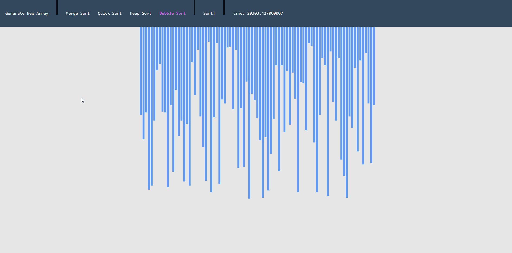

# React Sorting Algorithm Comparator

This app is developed to visualize and compare time efficiency of sorting algorithms.

Inspired by Clement Mihailescu's Sorting Visualizer project.





## How to run
Simply clone the repo and open "index.html" file with your browser.


## Development
Requires node and npm installed.

Install npm packages by using:
```
npm i
```

Then start the project in dev mode:
```
npm run-script dev
```

## Deployment
...